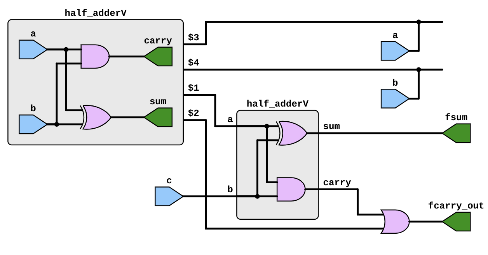
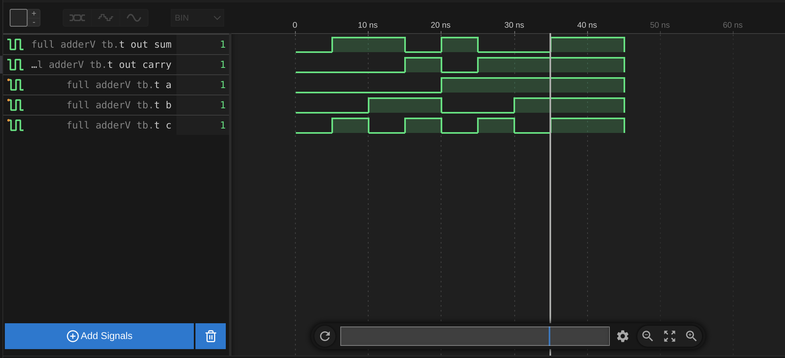

# Full adder module


## Code

full\_adderV.v:
```
`include "half_adderV.v"

module full_adderV (fsum, fcarry_out, a, b, c); 
    input   a, b, c; 
    output  fsum, fcarry_out; 
    wire    half_sum_1, half_carry_1, half_carry_2; 
    
    //module half_adderV(sum, carry, a, b); 
    half_adderV HA1(half_sum_1, half_carry_1, a, b); //instance 1 of Half Adder
    
    //half_adder HA2(fsum, half_carry_2, half_sum_1, c); //instance 2 of Half Adder
    half_adderV HA2(
                    .sum(fsum), 
                    .carry(half_carry_2), 
                    .a(half_sum_1), 
                    .b(c)
                    ); //instance 2 of Half Adder
                        
    or or1(fcarry_out, half_carry_2, half_carry_1); 
    
endmodule
```

half\_adderV.v:
```
module half_adderV(sum, carry, a, b); 
    input   a, b; 
    output  sum, carry; 
    
    xor sum1(sum, a, b); 
    and carry1(carry, a, b); 
endmodule
```

## Test bench
```
`include "full_adderV.v"
`timescale 1ns / 1ns

module full_adderV_tb; 

    wire    t_out_sum, t_out_carry; 
    reg     t_a, t_b, t_c; 
    
    full_adderV my_full_adder(.a(t_a), .b(t_b), .c(t_c), .fsum(t_out_sum), .fcarry_out(t_out_carry)); 
    
    initial begin
        $dumpfile("test_bench.vcd");
        $dumpvars;
        $monitor("%d  --->  %b %b %b %b %b",$time, t_a, t_b, t_c, t_out_carry, t_out_sum);
    end

    initial begin 
        t_a = 1'b0;     // 1 
        t_b = 1'b0; 
        t_c = 1'b0;  
        
        #5 //2     
        t_a = 1'b0; 
        t_b = 1'b0; 
        t_c = 1'b1;
        
        #5 //3 
        t_a = 1'b0; 
        t_b = 1'b1; 
        t_c = 1'b0;
        
        #5 //4 
        t_a = 1'b0; 
        t_b = 1'b1; 
        t_c = 1'b1;
        
        #5 //5 
        t_a = 1'b1; 
        t_b = 1'b0; 
        t_c = 1'b0;
        
        #5 //6 
        t_a = 1'b1; 
        t_b = 1'b0; 
        t_c = 1'b1;
        
        #5 //7 
        t_a = 1'b1; 
        t_b = 1'b1; 
        t_c = 1'b0;
    
        #5 //8
        t_a = 1'b1; 
        t_b = 1'b1; 
        t_c = 1'b1;
        
        #10
        $finish;
    end 
endmodule
```

## Synthesis results



## Simulation results


