# Combo scheme as always example

## Code
```
module combo1 (input a, 
					input b,
					input c,
					input d,
					output reg o);
	always @ (a or b or c or d) begin
		o <= ~((a & b) | (c^d));
	end
endmodule
```
## Test bench
```
`include "combo_always_tb.v"

module tb;
	reg a, b, c, d;
	wire o;
	integer i;
	combo1 u0 ( .a(a), .b(b), .c(c), .d(d), .o(o));
	initial begin
		$dumpfile("combo_always.vcd");
		$dumpvars;
		a <= 0;
		b <= 0;
		c <= 0;
		d <= 0;
		$monitor ("a=%0b b=%0b c=%0b d=%0b o=%0b", a, b, c, d, o);
		for (i = 0; i < 16; i = i + 1) begin
			{a, b, c, d} = i;
			#10;
		end
	end
endmodule
```


## Synthesis results

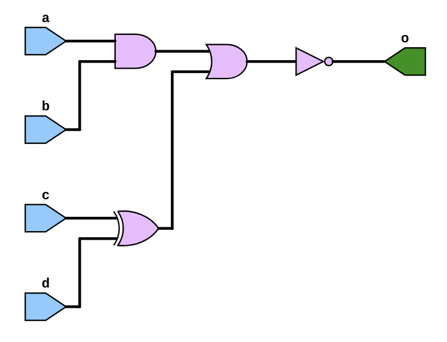

## Simulation results

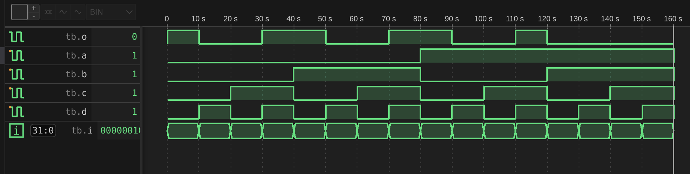

# Combo scheme as simple combinational logic example

## Code
```
module combo ( input a, b, c, d, e, output reg z);
	always @ ( a or b or c or d or e) begin
		z = ((a & b) | (c ^ d) & ~e);
	end
endmodule
```

## Test bench
```
`include "combo.v"

module combo_tb;
	reg a, b, c, d, e;
	wire z;
	integer i;
	combo u0 ( .a(a), .b(b), .c(c), .d(d), .e(e), .z(z));
	initial begin
		$dumpfile ("combo_tb.vcd");
		$dumpvars;
		a <= 0;
		b <= 0;
		c <= 0;
		d <= 0;
		e <= 0;
		// $monitor ("a=%0b b=%0b c=%0b d=%0b e=%0b z=%0b", a, b, c, d, e, z);
		for (i = 0; i < 32; i = i + 1) begin
			{a, b, c, d, e} = i;
			#10;
		end
	#5 $finish;
end
endmodule
```

## Synthesis results

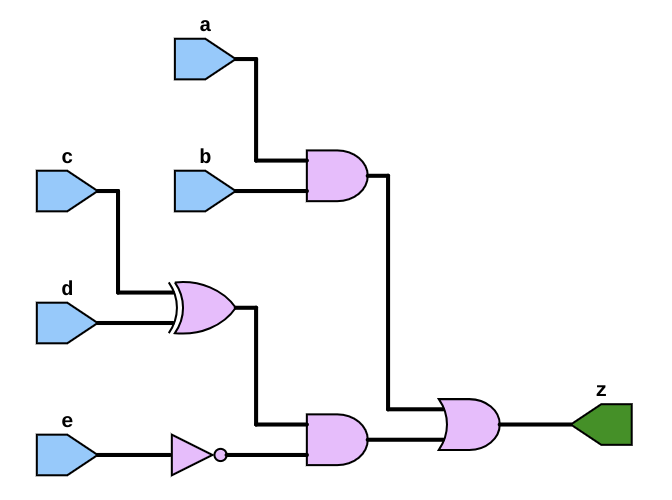

## Simulation results

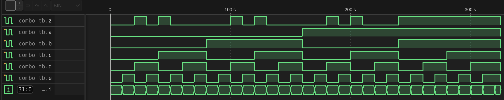

# Half adder

## Code
```
module halfadd ( input a, b, output reg sum, cout);
	always @ (a or b) begin
		{cout, sum} = a + b;
	end
endmodule
```

## Corrections

In original at [tutorial site](https://www.chipverify.com/verilog/verilog-sequential-logic-always#modulo-10-counter) the
variable "sum" was declared without "reg" keyword, which resulted in error:
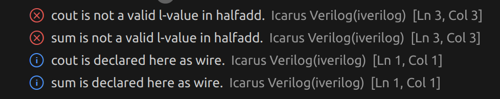
which is because one cannot assign values to wires in always block

## Test bench
```
`include "halfadd.v"

module tb;
	reg a, b;
	wire sum, cout;
	integer i;
	halfadd u0 ( .a(a), .b(b), .sum(sum), .cout(cout));
	initial begin
		$dumpfile("halfadd_tb.vcd");
		$dumpvars;
		a <= 0;
		b <= 0;
		$monitor("a=%0b b=%0b sum=%0b cout=%0b", a, b, sum, cout);
		for (i = 0; i < 4; i = i + 1) begin
			{a, b} = i;
			#10;
		end
	end
endmodule
```

## Synthesis results

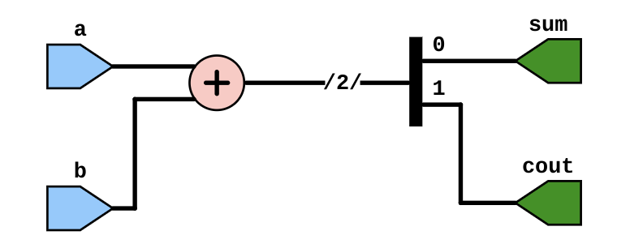

## Simulation results

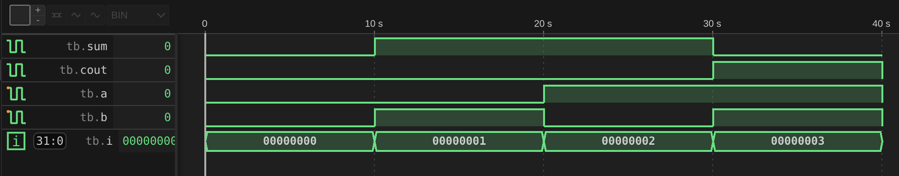

# Full adder 

## Code
```
module fulladd ( input a, b, cin, output reg sum, cout);
	always @ (a or b or cin) begin
		{cout, sum} = a + b + cin;
	end
endmodule
```

## Test bench
```
`include "fulladd.v"

module tb;
	reg a, b, cin;
	wire sum, cout;
	integer i;
	fulladd u0 ( .a(a), .b(b), .cin(cin), .sum(sum), .cout(cout));
	initial begin
		$dumpfile("fulladd_tb.vcd");
		$dumpvars;
		a <= 0;
		b <= 0;
		$monitor("a=%0b b=%0b cin=%0b cout=%0b sum=%0b", a, b, cin, cout, sum);
		for (i = 0; i < 8; i = i + 1) begin
			{a, b, cin} = i;
			#10;
		end
	end
endmodule
```

## Synthesis results

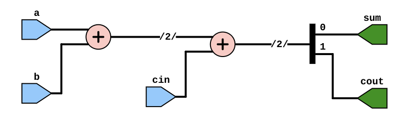

## Simulation results

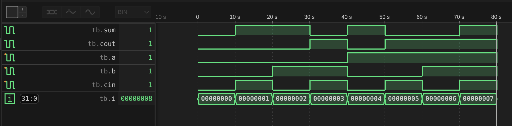

# 2x1 multiplexer

## Code
```
module mux21 (input a, b, sel, output reg c);
	always @ ( a or b or sel) begin
		c = sel ? a : b;
	end
endmodule
```

## Test bench
```
`include "mux21.v"

module tb;
	reg a, b, sel;
	wire c;
	integer i;
	mux21 u0 ( .a(a), .b(b), .sel(sel), .c(c));
	initial begin
		$dumpfile("mux21_tb.vcd");
		$dumpvars;
		a <= 0;
		b <= 0;
		sel <= 0;
		$monitor("a=%0b b=%0b sel=%0b c=%0b", a, b, sel, c);
		for (i = 0; i < 3; i = i + 1) begin
			{a, b, sel} = i;
		#10;
		end
	end
endmodule
```

## Synthesis results

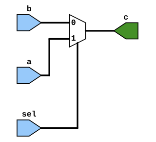

## Simulation results

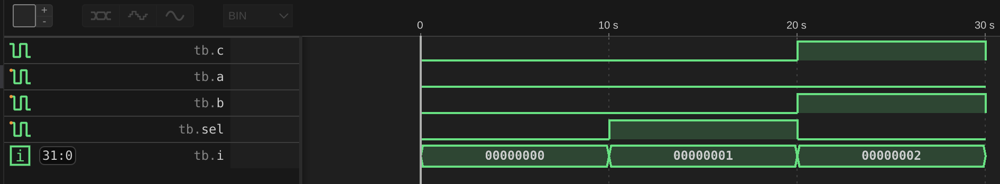

# 1x4 demultiplexer 

## Code
```
module demux14 ( input f, input [1:0] sel, output reg a, b, c, d);
	always @ ( f or sel) begin
		a = f & ~sel[1] & ~sel[0];
		b = f & sel[1] & ~sel[0];
		c = f & ~sel[1] & sel[0];
		d = f & sel[1] & sel[0];
	end
endmodule
```

## Test bench
```
`include "demux14.v"

module tb;
	reg f;
	reg [1:0] sel;
	wire a, b, c, d;
	integer i;
	demux14 u0 (.f(f), .sel(sel), .a(a), .b(b), .c(c), .d(d));
	initial begin
		$dumpfile("demux14_tb.vcd");
		$dumpvars;
		f <= 0;
		sel <= 0;
		$monitor("f=%0b sel=%0b a=%0b b=%0b c=%0b d=%0b", f, sel, a, b, c, d);
		for (i = 0; i < 8; i = i + 1) begin
			{f, sel} = i;
			#10;
		end
	end
endmodule
```

## Synthesis results

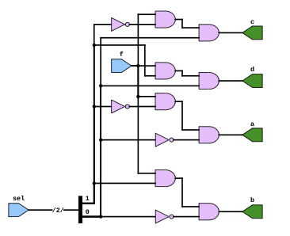

## Simulation results

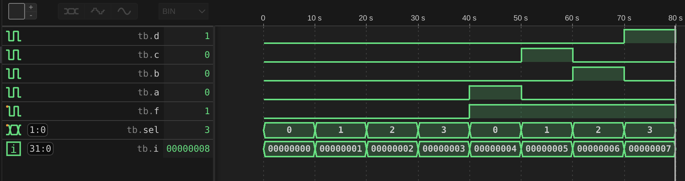

# 4x16 decoder 

## Code
```
module decod_4x16 ( input en, input [3:0] in, output reg [15:0] out);
	always @ (en or in) begin
		out = en ? 1 << in: 0;
	end
endmodule
```

## Test bench
```
`include "decod_4x16.v"

module tb;
	reg en;
	reg [3:0] in;
	wire [15:0] out;
	integer i;
	decod_4x16 u0 ( .en(en), .in(in), .out(out));
	initial begin
		$dumpfile("decod_4x16.vcd");
		$dumpvars;
		en <= 0;
		in <= 0;
		$monitor("en=%0b in=0x%0h out=0x%0h", en, in, out);
		for (i = 0; i < 32; i = i + 1) begin
			{en, in} = i;
			#10;
		end
	end
endmodule
```

## Synthesis results

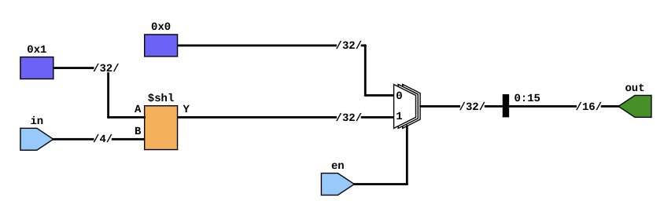

## Simulation results

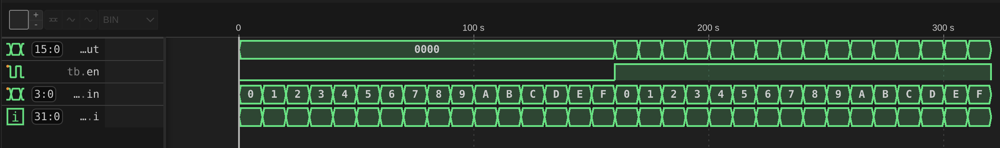

# JK flip flop

## Code
```
module jk_flip_flop ( input j, // Input J
					input k, // Input K
					input rstn, // Active-low async reset
					input clk, // Input clk
					output reg q); // Output Q
	always @ (posedge clk or negedge rstn) begin
		if (!rstn) begin
			q <= 0;
		end else begin
			q <= (j & ~q) | (~k & q);
		end
	end
endmodule
```

## Test bench
```
`include "jk_flip_flop.v"

module tb;
	reg j, k, rstn, clk;
	wire q;
	integer i;
	reg [2:0] dly;
	always #10 clk = ~clk;
	jk_flip_flop u0 (.j(j), .k(k), .clk(clk), .rstn(rstn), .q(q));
	initial begin
		$dumpfile("jk_filp_flop.vcd");
		$dumpvars;
		{j, k, rstn, clk} <= 0;
		#10 rstn <= 1;
		for (i = 0; i < 10; i = i+1) begin
			dly = $random;
			#(dly) j <= $random;
			#(dly) k <= $random;
		end
		#20 $finish;
	end
endmodule
```

## Synthesis results

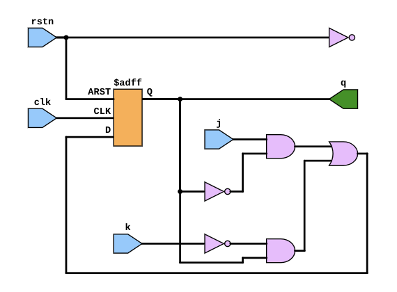

## Simulation results

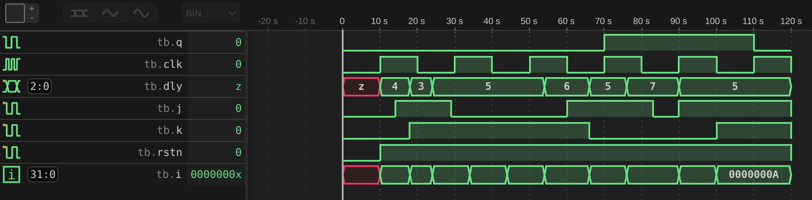

# Modulo-10 counter 

## Code
```
module mod10_count ( input clk,
							input rstn,
							output reg[3:0] out);
							
	always @ (posedge clk) begin
		if (!rstn) begin
			out <= 0;
		end else begin
			if (out == 10)
				out <= 0;
			else
				out <= out + 1;
		end
	end
endmodule
```


## Test bench
```
`include "mod10_count.v"

module tb;
	reg clk, rstn;
	wire [3:0] out;
	mod10_count u0 ( .clk(clk), .rstn(rstn), .out(out));
	always #10 clk = ~clk;
	initial begin
		$dumpfile("mod10_count.vcd");
		$dumpvars;
		{clk, rstn} <= 0;
		#10 rstn <= 1;
		#450 $finish;
	end
endmodule
```
## Corrections

In original at [tutorial site](https://www.chipverify.com/verilog/verilog-sequential-logic-always#modulo-10-counter) the "out" variable in testbench was declared as reg, but the folowing error occured:

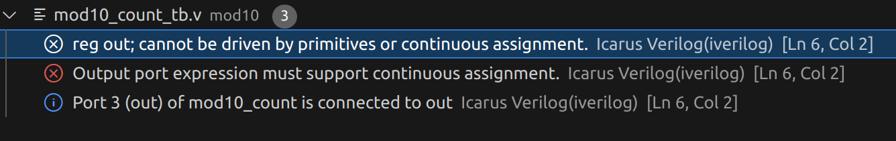

which is correct error, because we can't use reg for continuos assignment

## Synthesis results

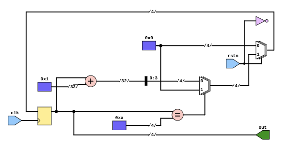

## Simulation results

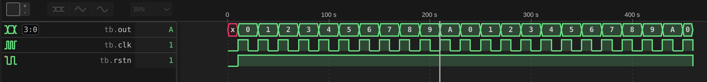

# 4bit Left Shift register 

## Code
```
module lshift_4b_reg(input d,
							input clk,
							input rstn,
							output reg [3:0] out);
	always @ (posedge clk) begin
		if (!rstn) begin
			out <= 0;
		end else begin
			out <= {out[2:0], d};
		end
	end
endmodule
```

## Test bench
```
`include "lshift_4b_reg.v"

module tb;
	reg clk, rstn, d;
	wire [3:0] out;
	integer i;
	lshift_4b_reg u0 ( .d(d), .clk(clk), .rstn(rstn), .out(out));
	always #10 clk = ~clk;
	initial begin
		$dumpfile("lshift4b.vcd");
		$dumpvars;
		{clk, rstn, d} <= 0;
		#10 rstn <= 1;
		for (i = 0; i < 20; i=i+1) begin
			@(posedge clk) d <= $random;
		end
		#10 $finish;
	end
endmodule
```

## Synthesis results

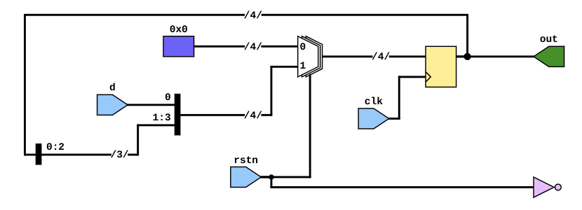

## Simulation results

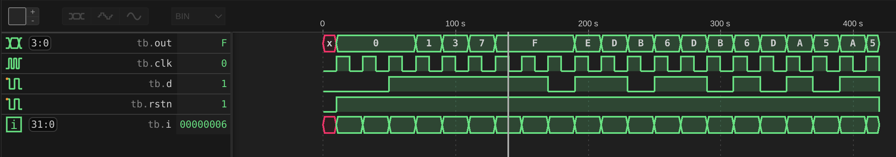

