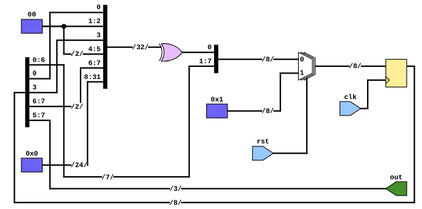
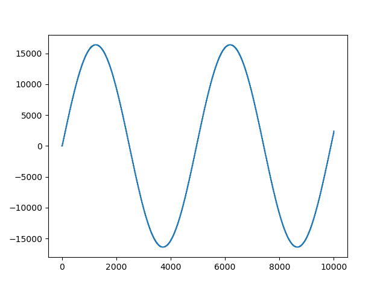

## First: intro to cocotb

### Verilog code:

```verilog
module my_design(input logic clk);

  timeunit 1ns;
  timeprecision 1ns;

  logic my_signal_1;
  logic my_signal_2;

  assign my_signal_1 = 1'bx;
  assign my_signal_2 = 0;

endmodule
```

### TestBench:

```verilog
import cocotb
from cocotb.triggers import Timer

@cocotb.test()
async def my_first_test(dut):
    """Try accessing the design."""

    for cycle in range(10):
        dut.clk.value = 0
        await Timer(1, units="ns")
        dut.clk.value = 1
        await Timer(1, units="ns")

    dut._log.info("my_signal_1 is %s", dut.my_signal_1.value)
    assert dut.my_signal_2.value[0] == 0, "my_signal_2[0] is not 0!"


# test_my_design.py (extended)

import cocotb
from cocotb.triggers import FallingEdge, Timer


async def generate_clock(dut):
    """Generate clock pulses."""

    for cycle in range(10):
        dut.clk.value = 0
        await Timer(1, units="ns")
        dut.clk.value = 1
        await Timer(1, units="ns")


@cocotb.test()
async def my_second_test(dut):
    """Try accessing the design."""

    await cocotb.start(generate_clock(dut))  # run the clock "in the background"

    await Timer(5, units="ns")  # wait a bit
    await FallingEdge(dut.clk)  # wait for falling edge/"negedge"

    dut._log.info("my_signal_1 is %s", dut.my_signal_1.value)
    assert dut.my_signal_2.value[0] == 0, "my_signal_2[0] is not 0!"
```

### Test result:


## Second part: matrix multiplication

Source code for matrix multiplication itself and test can be found at ./matrix\_mult/hdl and  ./matrix\_mult/tests respectively (too big to insert here)

### Test results:


## Third: NCO

### NCO.v:
```verilog
`include "nco_dither_lsfr.v"


module NCO (clk, rst, step, out);

parameter STEP_SIZE = 16; // integer part of of phase accumulator
parameter ADDR_WIDTH = 8; // integer part of of phase accumulator
parameter LUT_WIDTH = 16; 

localparam FRACT_WIDTH = STEP_SIZE-ADDR_WIDTH; // fractional part of phase accumulator

input clk;
input rst;
input [STEP_SIZE-1:0] step; // defines sinwave frequency
output reg signed [LUT_WIDTH-1:0] out;

reg signed [LUT_WIDTH-1:0] LUT [2**ADDR_WIDTH-1:0];
reg [STEP_SIZE+FRACT_WIDTH-1:0] ph_accum;


// RTL code for phase accumulator'

always @(posedge clk) begin
    if (rst)
        ph_accum <= 0;
    else
        ph_accum <= ph_accum + step;
end


// generate SIN LUT contents
localparam PI = $atan(1)*4.0;
// Potentially here can be troubles in 'initial'
// if yes, then generate file from other lang and use `$readmemb` or `$readmemh`

initial begin: sin_lut
real phase;
    for (phase = 0; phase < 2**ADDR_WIDTH; phase=phase+1) begin
       LUT[int' (phase) ] = ($sin(2*PI * phase / 2.0**ADDR_WIDTH)) * 2**(LUT_WIDTH - 2);
    end
end

// dither generation
wire [1:0] dither;
// assign dither = 0;
nco_dither_lsfr generator (.clk(clk), .rst(rst), .out(dither));

// addr generation
reg [ADDR_WIDTH-1:0] addr;

always @(posedge clk) begin
    if (rst)
        addr <= 0;
    else
        addr <= dither + ph_accum [ADDR_WIDTH+FRACT_WIDTH-1:FRACT_WIDTH];
end


// LUT ouput generation from ROM
always @ (posedge clk)
	begin
		out <= LUT[addr];
	end

endmodule
```

### nco\_dither\_lfsr.v:

```verilog
module nco_dither_lsfr (clk, rst, out);

parameter OUT_SIZE=2;
parameter LSFR_POLY='b11001001;

localparam LSFR_SIZE=$clog2(LSFR_POLY);

input clk;
input rst; 
output [OUT_SIZE-1:0] out;

reg [LSFR_SIZE-1:0] lsfr;

assign out = lsfr[LSFR_SIZE-1:LSFR_SIZE-OUT_SIZE];

wire lsfr_next;

// below line with default parameters is equivalent to
// lsfr_next = lsfr [5] ^ lsfr[4] ^ lsfr[1] ^ lsfr[0];
assign lsfr_next = ^(lsfr & LSFR_POLY);

always @(posedge clk) begin
    if (rst) begin
	    lsfr <= 'b01;
	end
	else
	begin
		lsfr <= {lsfr[LSFR_SIZE-2:0], lsfr_next};
		// above line equvivalent to below 2 lines
		// lsfr[LSFR_SIZE-1:1] <= lsfr[LSFR_SIZE-2:0];
		// lsfr[0] <= lsfr_next;
	end
end
endmodule


```

lfsr design:



### testbench:

Generated sin:



pictures:

generated with:

```python
import numpy as np
import matplotlib.pyplot as plt

sinus = np.fromfile('sin_log.data')

plt.plot(sinus)
plt.savefig('Sin example')
plt.show()

spectre = np.fft.fftshift(np.fft.fft(sinus))
amplitude = np.abs(spectre)

amp_db = 10 * np.log10(amplitude)
amps_amount = amp_db.size
freqs = np.arange(start = -amps_amount / 2, stop = amps_amount/ 2)

plt.figure()
plt.plot(freqs, amp_db)
step = 4000
plt.title(f'Step = {step}')
# plt.xlabel('freq, Hz')
plt.ylabel('amlplitude, db')
plt.savefig(f'sin_step{step}dither.png')
plt.show()
```

With dither:


Without dither:


